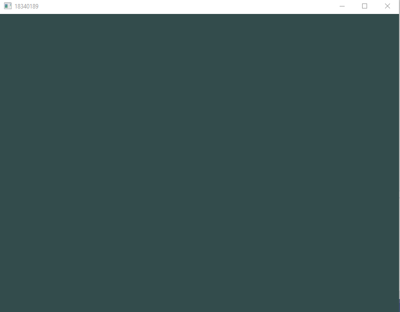
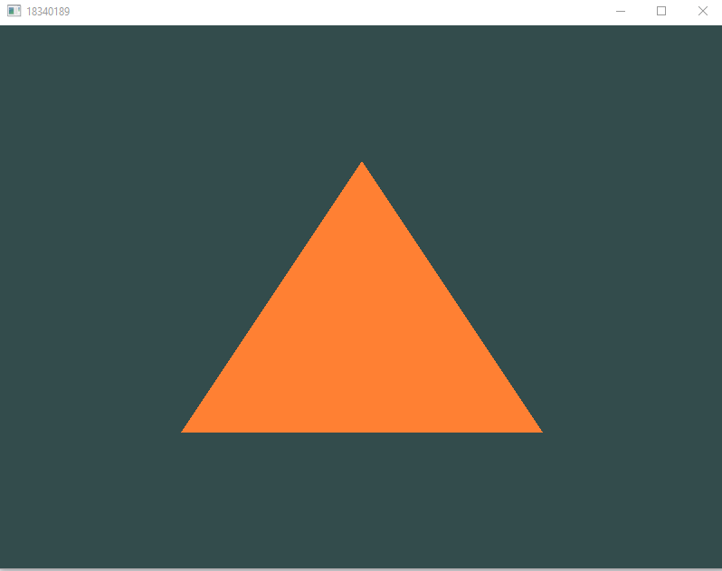

# 计算机图形学实验0——实验报告

学号：18340189 	姓名：杨伯宇	 专业：计算机科学


## JOB1——什么是OpenGL？OpenGL与计算机图形学的关系是什么？  

​		OpenGL（Open Graphics Library）是用于渲染2D、3D矢量图形的跨语言、跨平台的应用程序编程接口（API）。这个接口由近350个不同的函数调用组成，用来从简单的图形比特绘制复杂的三维景象。而另一种程序接口系统是仅用于Microsoft Windows上的Direct3D。OpenGL常用于CAD、虚拟现实、科学可视化程序和电子游戏开发。

​		OpenGL规范严格规定了每个函数该如何执行，以及它们的输出值。至于内部具体每个函数是如何实现(Implement)的，将由OpenGL库的开发者自行决定。因为OpenGL规范并没有规定实现的细节，具体的OpenGL库允许使用不同的实现，只要其功能和结果与规范相匹配（亦即，作为用户不会感受到功能上的差异）。

​		实际的OpenGL库的开发者通常是显卡的生产商。你购买的显卡所支持的OpenGL版本都为这个系列的显卡专门开发的。当你使用Apple系统的时候，OpenGL库是由Apple自身维护的。在Linux下，有显卡生产商提供的OpenGL库，也有一些爱好者改编的版本。这也意味着任何时候OpenGL库表现的行为与规范规定的不一致时，基本都是库的开发者留下的bug。

​		计算机图形学主要是一种使用数学算法将二维或三维图形转化为计算机显示器的栅格形式的科学，当然其包含的范围不止如此。而OpenGL是一个实现二维或三维图像的工具，帮助程序员/美术等完成计算机上的图形创作。无论是写一个OpenGL的实现，亦或是使用OpenGL，都需要用到计算机图形学的知识。


## JOB2——请将在教程你好，窗口、你好，三角形、着色器的实现结果贴出来，要求将实现的窗口的标题改成自己的学号

### 1.	你好，窗口



#### 实现思路

1. 初始化GLFW

   ```c++
   	glfwInit();																//调用glfwInit函数来初始化GLFW
       glfwWindowHint(GLFW_CONTEXT_VERSION_MAJOR, 3);							//使用glfwWindowHint函数来配置GLFW
       glfwWindowHint(GLFW_CONTEXT_VERSION_MINOR, 3);
       glfwWindowHint(GLFW_OPENGL_PROFILE, GLFW_OPENGL_CORE_PROFILE);
   ```

2. 接下来我们创建一个窗口对象，这个窗口对象存放了所有和窗口相关的数据，

   ```c++
   GLFWwindow* window = glfwCreateWindow(800, 600, "LearnOpenGL", NULL, NULL);  //在glfwCreateWindow函数中设置窗口的宽和高
   if (window == NULL)
   {
       std::cout << "Failed to create GLFW window" << std::endl;
       glfwTerminate();
       return -1;
   }
   glfwMakeContextCurrent(window);
   ```

3. 初始化glad

   ```c++
   if (!gladLoadGLLoader((GLADloadproc)glfwGetProcAddress))
   {
       std::cout << "Failed to initialize GLAD" << std::endl;
       return -1;
   }
   //GLAD是用来管理OpenGL的函数指针的，所以在调用任何OpenGL的函数之前我们需要初始化GLAD。
   ```

4. 告诉OpenGL渲染窗口的尺寸大小

   ```c++
   glViewport(0, 0, 800, 600);
   //我们实际上也可以将视口的维度设置为比GLFW的维度小，这样子之后所有的OpenGL渲染将会在一个更小的窗口中显示，这样子的话我们也可以将一些其它元素显示在OpenGL视口之外。
   ```

   在运行时修改窗口大小

   ```c++
   void framebuffer_size_callback(GLFWwindow* window, int width, int height) //当窗口大小被改变时，要修改视口大小
   {
       glViewport(0, 0, width, height);
   }
   glfwSetFramebufferSizeCallback(window, framebuffer_size_callback);	//当窗口大小被改变时，调用上述函数
   ```

5. 开始渲染

   ```c++
   while(!glfwWindowShouldClose(window))//在我们每次循环的开始前检查一次GLFW是否被要求退出，如果是的话该函数返回true然后渲染循环便结束了，之后为我们就可以关闭应用程序了。
   {
       glfwSwapBuffers(window);//函数会交换颜色缓冲（它是一个储存着GLFW窗口每一个像素颜色值的大缓冲），它在这一迭代中被用来绘制，并且将会作为输出显示在屏幕上
       glfwPollEvents();    //函数检查有没有触发什么事件（比如键盘输入、鼠标移动等）、更新窗口状态，并调用对应的回调函数（可以通过回调方法手动设置）
   }
   ```

6. 释放资源

   ```c++
   glfwTerminate();
   return 0;
   ```

7. 在渲染时接受输入

   ```c++
   void processInput(GLFWwindow *window)
   {
       if(glfwGetKey(window, GLFW_KEY_ESCAPE) == GLFW_PRESS)//检测用户是否按下了ESC键
           glfwSetWindowShouldClose(window, true);
   }
   ```

   并在渲染中加入这条语句，使得在按下ecs的时候窗口会退出

8. 增加窗口颜色

   ```c++
   glClearColor(0.2f, 0.3f, 0.3f, 1.0f); //设置清空屏幕所使用的颜色
   glClear(GL_COLOR_BUFFER_BIT);		//清空屏幕
   ```

   将7，8加入到渲染里面

   ```c++
   while(!glfwWindowShouldClose(window))
   {
       // 输入
       processInput(window);
   
       // 渲染指令
       glClearColor(0.2f, 0.3f, 0.3f, 1.0f);
   	glClear(GL_COLOR_BUFFER_BIT);
   
       // 检查并调用事件，交换缓冲
       glfwPollEvents();
       glfwSwapBuffers(window);
   }
   ```

   结束

   ```mermaid
   graph TD
   id1(调用glfwInit函数来初始化GLFW)
   id2(使用glfwWindowHint函数来配置GLFW)
   id3(在glfwCreateWindow函数中设置窗口的宽和高)
   id4(初始化glad)
   id5(在glViewport中设置渲染窗口尺寸)
   id6(循环渲染)
   id7(使用glfwSwapBuffers交换颜色缓冲)
   id8(使用glfwPollEvents查看有没有触发什么事件)
   
   id1-->id2
   id2-->id3
   id3-->id4
   id4-->id5
   id5-->id6
   id6-->id7
   id7-->id8
   ```
   
   

### 2.你好，三角形



#### 	实现思路

1. 顶点着色器

   ```c++
   const char* vertexShaderSource = "#version 330 core\n"	//顶点着色器的代码
   "layout (location = 0) in vec3 aPos;\n"
   "void main()\n"
   "{\n"
   "   gl_Position = vec4(aPos.x, aPos.y, aPos.z, 1.0);\n"
   "}\0";
   int vertexShader = glCreateShader(GL_VERTEX_SHADER);		//创建顶点着色器
   glShaderSource(vertexShader, 1, &vertexShaderSource, NULL) //顶点着色器是一个程序，这里把它的代码放入，进行初始化
   glCompileShader(vertexShader);								//编译顶点着色器
   //查看编译是否成功
   int success;
   char infoLog[512];											//存储编译信息
   glGetShaderiv(vertexShader, GL_COMPILE_STATUS, &success);
   if (!success)													//没有成功时打印错误信息
   {
       glGetShaderInfoLog(vertexShader, 512, NULL, infoLog);
       std::cout << "ERROR::SHADER::VERTEX::COMPILATION_FAILED\n" << infoLog << std::endl;
   }
   ```

2. 片段着色器

   ```c++
   int fragmentShader = glCreateShader(GL_FRAGMENT_SHADER);					//创建片段着色器
   glShaderSource(fragmentShader, 1, &fragmentShaderSource, NULL);
   glCompileShader(fragmentShader);
   // check for shader compile errors
   glGetShaderiv(fragmentShader, GL_COMPILE_STATUS, &success);
   if (!success)
   {
       glGetShaderInfoLog(fragmentShader, 512, NULL, infoLog);
       std::cout << "ERROR::SHADER::FRAGMENT::COMPILATION_FAILED\n" << infoLog << std::endl;
   }
   ```

   ```mermaid
   graph TD
   id1(使用glCreateShader创建顶点着色器)
   id2(使用glShaderSource放入顶点着色器的代码进行初始化)
   id3(使用glCompileShader编译顶点着色器)
   id4(使用glGetShaderiv查看编译是否成功)
   
   error_1(打印错误信息)
   error_2(打印错误信息)
   error_3(打印错误信息)
   
   id5(使用glCreateShader创建片段着色器)
   id6(使用glShaderSource放入片段着色器的代码进行初始化)
   id7(使用glCompileShader编译片段着色器)
   id8(使用glGetShaderiv查看编译是否成功)
   id9(使用glCreateProgram创建着色器程序)
   id10(使用AttachShader将顶点着色器和片段着色器加入着色器程序)
   id11(使用glLinkProgram链接着色器程序)
   id11_2(使用glGetShaderiv查看编译是否成功)
   id12(创建顶点坐标)
   id13(使用glGenBuffers建立顶点缓冲)
   id14(使用glBindBuffer把新创建的缓冲绑定到目标上)
   id15(调用glBufferData函数把之前定义的顶点数据复制到缓冲的内存中)
   id16(使用glVertexAttribPointer解析顶点数据)
   id17(使用glEnableVertexAttribArray启用顶点属性)
   id18(使用glGenVertexArrays创建VAO)
   id19(使用glBindVertexArray绑定VAO)
   id20(使用glBindVertexArray把顶点数组复制到缓冲中供OpenGL使用)
   id21(循环渲染)
   id22(使用glDrawArrays来绘制三角形)
   
   id1-->id2
   id2-->id3
   id3-->id4
   
   id4-->|否|error_1
   id4-->|是|id9
   
   
   id8-->|是|id9
   id8-->|否|error_2
   
   
   id5-->id6
   id6-->id7
   id7-->id8
   
   
   id12-->id13
   id13-->id14
   id14-->id15
   id15-->id16
   id16-->id17
   
   id9-->id10
   id10-->id11
   
   
   
   
   id11-->id11_2
   id11_2-->|是|id12
   id11_2-->|否|error_3
   
   id17-->id18
   id18-->id19
   id19-->id20
   id20-->id21
   id21-->id22
   
   
   
   ```

   

### 3.着色器


#### 	实现思路


整体思路和你好三角形几乎一样，但是一些细节上有出入，所以就不画流程图了。说一下具体的实现。

一个是颜色随时间变化：

首先，颜色可以在顶点着色器和片段着色器的源代码中定义。如下代码

```c++
//顶点着色器
#version 330 core
layout (location = 0) in vec3 aPos; // 位置变量的属性位置值为0
out vec4 vertexColor; // 为片段着色器指定一个颜色输出
void main()
{
    gl_Position = vec4(aPos, 1.0); // 注意我们如何把一个vec3作为vec4的构造器的参数
    vertexColor = vec4(0.5, 0.0, 0.0, 1.0); // 把输出变量设置为暗红色
}
```

```c++
//片段着色器
#version 330 core
out vec4 FragColor;
in vec4 vertexColor; // 从顶点着色器传来的输入变量（名称相同、类型相同）
void main()
{
    FragColor = vertexColor;
}
```

片段着色器接收顶点着色器的输入（$vertexColor$），就可以把颜色变为暗红色，只要他们的变量名和类型一样


​		所以，只要在运行时能够更改这里的$FragColor$，就可以实现在运行时修改颜色。这里就要用到$Uniform$,$Uniform$是全局的，对于每个着色器变量都是独一无二的。所以把片段染色器的$FragColor\ =\ vertexColor$中的$vertexColor$设置为uniform,而顶点着色器不再用$vertexColor$，并且在运行时修改$vertexColor$，就可以实现在运行时修改颜色。

代码如下

```c++
//片段着色器
#version 330 core
out vec4 FragColor;
uniform vec4 ourColor; // 在OpenGL程序代码中设定这个变量
void main()
{
    FragColor = ourColor;
}
```

在循环渲染中加入如下代码

```c++
float timeValue = glfwGetTime();					//获取时间
float greenValue = (sin(timeValue) / 2.0f) + 0.5f;	//通过时间修改绿色
int vertexColorLocation = glGetUniformLocation(shaderProgram, "ourColor");			//查询ourcolor的位置
glUniform4f(vertexColorLocation, 0.0f, greenValue, 0.0f, 1.0f);						//修改uniform 的值
```

这样就实现了颜色随时间变化。


使用片段插值实现渐变：

首先在设置顶点的时候把颜色给加入

```c++
float vertices[] = {//前三列为位置，后三列为颜色
    // 位置              // 颜色
     0.5f, -0.5f, 0.0f,  1.0f, 0.0f, 0.0f,   // 右下
    -0.5f, -0.5f, 0.0f,  0.0f, 1.0f, 0.0f,   // 左下
     0.0f,  0.5f, 0.0f,  0.0f, 0.0f, 1.0f    // 顶部
};
```

修改顶点着色器和片段着色器，使顶点着色器能够接收颜色值作为一个顶点属性输入。需要注意的是我们用$layout$标识符来把$aColor$属性的位置值设置为$1$：

```c++
//顶点着色器
#version 330 core
layout (location = 0) in vec3 aPos;   // 位置变量的属性位置值为 0 
layout (location = 1) in vec3 aColor; // 颜色变量的属性位置值为 1
out vec3 ourColor; // 向片段着色器输出一个颜色
void main()
{
    gl_Position = vec4(aPos, 1.0);
    ourColor = aColor; // 将ourColor设置为我们从顶点数据那里得到的输入颜色
}
```

```c++
//片段着色器
#version 330 core
out vec4 FragColor;  
in vec3 ourColor;
void main()
{
    FragColor = vec4(ourColor, 1.0);
}
```

当我们设置的顶点数据格式改变的时候，也要重新分配顶点属性指针

```c++
// 位置属性
glVertexAttribPointer(0, 3, GL_FLOAT, GL_FALSE, 6 * sizeof(float), (void*)0);
glEnableVertexAttribArray(0);
// 颜色属性
glVertexAttribPointer(1, 3, GL_FLOAT, GL_FALSE, 6 * sizeof(float), (void*)(3* sizeof(float)));
glEnableVertexAttribArray(1);
```

运行时，片段着色器使用插值着色，一个点的颜色相当于三个点颜色的加权和，若更靠近上方，则蓝色更多，更靠近哪个点，哪个点的权值就越大。


## Job 3——纹理的实现和扩展


修改的代码如图

```c++
float vertices[] = {
        // positions          // colors           // texture coords
         0.5f,  0.5f, 0.0f,   1.0f, 0.0f, 0.0f,   2.0f, 2.0f, // top right
         0.5f, -0.5f, 0.0f,   0.0f, 1.0f, 0.0f,   2.0f, 0.0f, // bottom right
        -0.5f, -0.5f, 0.0f,   0.0f, 0.0f, 1.0f,   0.0f, 0.0f, // bottom left
        -0.5f,  0.5f, 0.0f,   1.0f, 1.0f, 0.0f,   0.0f, 2.0f  // top left 
    };
```

```c++
glTexParameteri(GL_TEXTURE_2D, GL_TEXTURE_WRAP_S, GL_CLAMP_TO_EDGE);	//木箱使用拉伸的方式
glTexParameteri(GL_TEXTURE_2D, GL_TEXTURE_WRAP_T, GL_CLAMP_TO_EDGE);
```

（笑脸默认使用拉伸的方式）

原因：

右上角对应（2.0f, 2.0f），在图像之外，图像会平铺延申，直到有（2.0f, 2.0f）这个位置，这样就把一个2*2笑脸平铺的结果放入到图片中。

而木箱使用拉伸的方式，默认在左下角，周围的图片都是其边缘拟合而来。


## job4——感想


​		学习了这些教程，我了解了屏幕上图像的由来。从建立一个窗口，到顶点着色器，片段着色器，并建立点来画出三角形，再到学习着色器的写法和增添材质，我发现这门课远没有我想象中那么简单，一旦涉及到贴近硬件部分的操作，无论是使用还是以后可能会考虑到的性能，都会异常复杂。