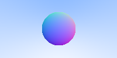
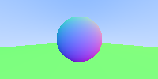
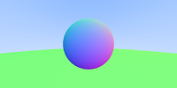
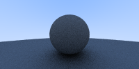
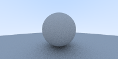
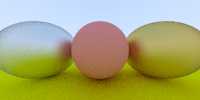
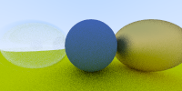
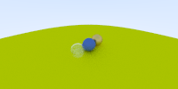
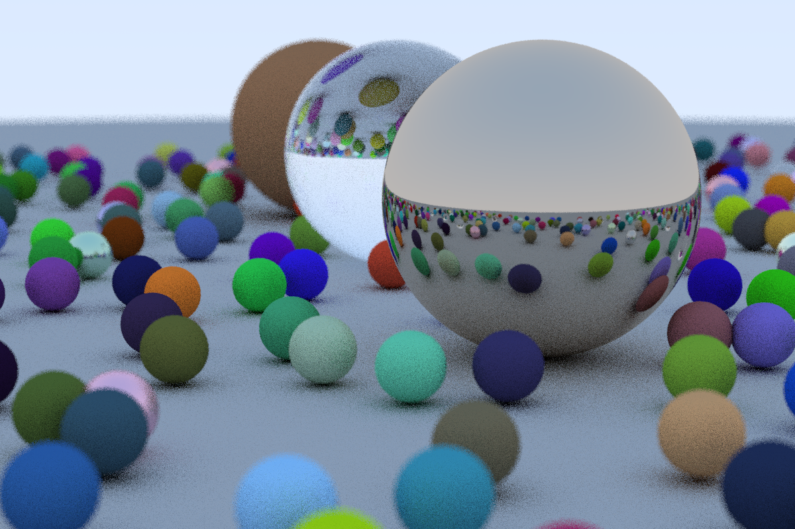
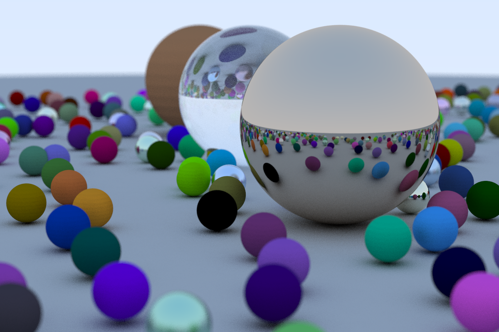

# 计算器图形学实验五——光线追踪

杨伯宇	18340189

## Task1：跟着教程实现Chapter 2 ~ Chapter 6的内容。

### chapter2

这一单元主要是将向量运算，声明和定义了vec3类，内容上没有什么值得再报告中指出的，非常容易实现

### chapter3

这一单元主要定义了光线类，一个光线可以写成$p(t) = A + t\times B$,$p$是三位坐标上的点，$A$是起始点，而$B$是方向，同时，$t$是光线传播的距离

```c++
class ray
{
public:
    ray()
    {
    }
    ray(const vec3 &a, const vec3 &b)
    {
        A = a;
        B = b;
    }
    vec3 origin() const
    {
        return A;
    }
    vec3 direction() const
    {
        return B;
    }
    vec3 point_at_parament(float t) const
    {
        return A + t * B;
    }
    vec3 A;
    vec3 B;
};
```

同时也定义了一个关于颜色的函数，它接受一个光线，判断它进入眼睛时时什么颜色的。再这里，定义了一个简单的关于平面坐标的表达式来返回由蓝色和白色组成的颜色。得到的结果如下


这里有一个图像输出的问题，可以把老师的给的类再打包一下，写成一个函数，接受像素点，直接生成一张png图片。函数如下

```c++
void get_image(std::vector<std::vector<vec3>> col_table, int width, int height)
{
	PathTracer tracer;
	tracer.initialize(width, height);

	// rendering.
	double timeConsuming = 0.0f;
	unsigned char *pixels = tracer.rend_with_color_table(col_table, timeConsuming);

	// save pixels to .png file using stb_image.
	stbi_flip_vertically_on_write(1);
	stbi_write_png("./result.png",
				   tracer.getWidth(),
				   tracer.getHeight(),
				   4,
				   static_cast<void *>(tracer.getImage()),
				   tracer.getWidth() * 4);

	std::cout << "Rendering Finished.\n";
	std::cout << "Time consuming: " << timeConsuming << " secs.\n";
}

```

其中调用的rend_with_color_table的定义如下

```c++
unsigned char *PathTracer::rend_with_color_table(std::vector<std::vector<vec3>> col_table, double &timeConsuming)
{
	if (m_image == nullptr)
	{
		std::cout << "Must call initialize() before rendering.\n";
		return nullptr;
	}

	// record start time.
	double startFrame = clock();

	// render the image pixel by pixel.
	for (int row = m_height - 1; row >= 0; --row)
	{
		for (int col = 0; col < m_width; ++col)
		{
			// TODO: implement your ray tracing algorithm by yourself.
			drawPixel(col, row, col_table[row][col]);
		}
	}

	// record end time.
	double endFrame = clock();

	// calculate time consuming.
	timeConsuming = static_cast<double>(endFrame - startFrame) / CLOCKS_PER_SEC;

	return m_image;
}
```


### chapter4

这里单元主要讲的是得到一个球。一个球在空间的坐标表达式为
$$
(x-a)^2+(y-b)^2+(z-c)^2=R^2
$$
对于一束光线$p(t) = A + t\times B$，可以得到
$$
(x_A+t\times x_B-a)^2+(y_A+t\times y_B-b)^2+(z_A+t\times z_B-c)^2=R^2
$$
这是一个关于$t$的表达式，我们只需要计算一下二次不等式的判别式即可判断光线是否和求面相交，于是定义一个函数来判断是否相交，函数如下

```c++
bool hit_sphere(const vec3 &center, float radius, const ray &r)
{
	vec3 oc = r.origin() - center;
	float a = dot(r.direction(), r.direction());
	float b = 2.0 * dot(oc, r.direction());
	float c = dot(oc, oc) - radius * radius;
	float discriminant = b * b - 4 * a * c;
	return discriminant > 0;
}
```

从而得到相应大的颜色。结果如下


### chapter5

这一段元主要讲曲面和多物体。可以修改上面的判断是否相交的函数，让其返回距离，再根据距离来计算得到表面的材质，结果如下



为了能在图像中显示多个物体，定义了一个结构体hit_record来记录碰撞的相关参数 和一个虚类，hitable表示光线能与其发生反射,

```c++
struct hit_record
{
    float t;
    vec3 p;
    vec3 normal;
};

class hitable
{
public:
    virtual bool hit(const ray &r, float t_min, float t_max, hit_record &rec) const = 0;
};
```

再用该类实例化为一个球类,

```c++
class sphere : public hitable
{
public:
    sphere()
    {
    }
    sphere(vec3 cen, float r) : center(cen), radius(r)
    {
    }
    virtual bool hit(const ray &r, float t_min, float t_max, hit_record &rec) const;
    vec3 center;
    float radius;
};
```

只需要半径和球心就可以表示该球

该球类能计算一束光线能否与该球相撞。其判断是否相撞的函数定义如下

```c++
bool sphere::hit(const ray &r, float t_min, float t_max, hit_record &rec) const
{
    vec3 oc = r.origin() - center;
    float a = dot(r.direction(), r.direction());
    float b = dot(oc, r.direction());
    float c = dot(oc, oc) - radius * radius;
    float discriminant = b * b - a * c;
    if (discriminant > 0)
    {
        float temp = (-b - sqrt(b * b - a * c)) / a;
        if (temp < t_max && temp > t_min)
        {
            rec.t = temp;
            rec.p = r.point_at_parament(rec.t);
            rec.normal = (rec.p - center) / radius;
            return true;
        }
        temp = (-b + sqrt(b * b - a * c)) / a;
        if (temp < t_max && temp > t_min)
        {
            rec.t = temp;
            rec.p = r.point_at_parament(rec.t);
            rec.normal = (rec.p - center) / radius;
            return true;
        }
    }
    return false;
}
```

接着，再实例化一个物体表类，来表示该场景的所有物体。它依次计算每个物体是否相撞，并返回结果。

定义两个球，结果如下




### chapter6

这一段元主要是讲的抗锯齿，同时定义了一个摄像机类（这里感觉没有很大的用处，主要是之后选择不同的视角使用）

摄像机类的定义如下，需要坐标原点，左下角坐标，水平距离和竖直距离

```c++
class camera
{
public:
    camera()
    {
        lower_left_corner = vec3(-2.0, -1.0, -1.0);
        horizontal = vec3(4.0, 0.0, 0.0);
        vertical = vec3(0.0, 2.0, 0.0);
        origin = vec3(0.0, 0.0, 0.0);
    }
    ray get_ray(float u, float v)
    {
        return ray(origin, lower_left_corner + u * horizontal + v * vertical - origin);
    }

    vec3 origin;
    vec3 lower_left_corner;
    vec3 horizontal;
    vec3 vertical;
};
```


摄像机类主要是定义了屏幕的大小和方向，并且用来计算有哪些光线会被摄像机捕捉。而对于抗锯齿，我们

再该点附近随机找一些点，取那些点的的颜色均值来得到该店的颜色，这里我们随机取100个点。结果如下。可以发现明显的变圆滑了。




## Task2：跟着教程实现Chapter 7 ~ Chapter 12的内容。


### chapter7 

这一单元主要是将漫反射材质。对于漫反射的实验，其实非常简单。就是当光射到球体表面的一个点时，随机选择再该点的外接单位球内的一点作为反射方向,代码如下

```c++
vec3 random_in_unit_sphere()
{
    vec3 p;
    do
    {
        p = 2.0 * vec3(drand48(), drand48(), drand48()) - vec3(1, 1, 1);
    } while (p.squared_length() >= 1.0);
    return p;
}
```

结果如下




但是效果并不好，看起来非常暗，可以把RBG的值开根号使其亮一点。相应代码如下

```c++
std::vector<std::vector<vec3>> col_table(ny, std::vector<vec3>(nx));
    for (int j = ny - 1; j >= 0; j--)
    {
        for (int i = 0; i < nx; i++)
        {
            vec3 col(0, 0, 0);
            for (int s = 0; s < ns; ++s)
            {
                float u = float(i + drand48()) / float(nx);
                float v = float(j + drand48()) / float(ny);
                ray r = cam.get_ray(u, v);
                vec3 p = r.point_at_parament(2.0);
                col += color(r, world);
            }

            col /= float(ns);
            col_table[j][i] = vec3(sqrt(col[0]), sqrt(col[1]), sqrt(col[2]));
        }
    }
    get_image(col_table, nx, ny);
```

结果如下



### chapter8

这一章主要是讲金属材质，先定义一个抽象类，来表示光线扩散。再将其实例化理想散射的材质，不管照明分布如何，其表面在所有的表面方向上接收并发散所有的入射照明。

再定义一个镜面反射函数，接受入射光和法线，返回反射光。

于是结合上述两点，即可得到金属类。效果如下。

这里获得颜色的函数就有了递归调用，对于反射的光线，进行相似的计算，代码如下

```c++
vec3 color(const ray &r, hitable *world, int depth)
{
    hit_record rec;

    if (world->hit(r, 0.001, FLT_MAX, rec))
    {
        ray scattered;
        vec3 attenuation;
        // std::cout << rec.mat_ptr->scatter(r, rec, attenuation, scattered) << std::endl;
        if (depth < 50 && rec.mat_ptr->scatter(r, rec, attenuation, scattered))
        {
            return attenuation * color(scattered, world, depth + 1);
        }
        else
        {
            return vec3(0, 0, 0);
        }
    }
    else
    {
        vec3 unit_direction = unit_vector(r.direction());
        float t = 0.5 * (unit_direction.y() + 1.0);
        return (1.0 - t) * vec3(1.0, 1.0, 1.0) + t * vec3(0.5, 0.7, 1.0);
    }
}
```

结果如下



### chapter9

这一章主要是讲这是折射。先定义一个折射的函数，接收入射光线，发现和折射角，来得到折射光线。

```c++
bool refract(const vec3 &v, const vec3 &n, float ni_over_nt, vec3 &refracted)
{
    vec3 uv = unit_vector(v);
    float dt = dot(uv, n);
    float discriminant = 1.0 - ni_over_nt * ni_over_nt * (1 - dt * dt);
    if (discriminant > 0)
    {
        refracted = ni_over_nt * (uv - n * dt) - n * sqrt(discriminant);
        return true;
    }
    else
    {
        return false;
    }
}
```

这里要使用snell定律，相应的函数如下

```c++
float schlick(float cosine, float ref_idx)
{
    float r0 = (1 - ref_idx) / (1 + ref_idx);
    r0 = r0 * r0;
    return r0 + (1 - r0) * pow((1 - cosine), 5);
}
```

由此得到一个有折射类，当然也有反射（从材质类继承），代码如下

```c++
class dielectric : public material
{
public:
    dielectric(float ri) : ref_idx(ri) {}
    virtual bool scatter(const ray &r_in, const hit_record &rec, vec3 &attenuation, ray &scattered) const
    {
        vec3 outward_normal;
        vec3 reflected = reflect(r_in.direction(), rec.normal);
        float ni_over_nt;
        attenuation = vec3(1.0, 1.0, 1.0);
        vec3 refracted;
        float reflect_prob;
        float cosine;
        if (dot(r_in.direction(), rec.normal) > 0)
        {
            outward_normal = -rec.normal;
            ni_over_nt = ref_idx;
            cosine = ref_idx * dot(r_in.direction(), rec.normal) / r_in.direction().length();
        }
        else
        {
            outward_normal = rec.normal;
            ni_over_nt = 1.0 / ref_idx;
            cosine = -dot(r_in.direction(), rec.normal) / r_in.direction().length();
        }
        if (refract(r_in.direction(), outward_normal, ni_over_nt, refracted))
        {
            reflect_prob = schlick(cosine, ref_idx);
        }
        else
        {
            scattered = ray(rec.p, reflected);
            reflect_prob = 1.0;
        }
        if (drand48() < reflect_prob)
        {
            scattered = ray(rec.p, reflected);
        }
        else
        {
            scattered = ray(rec.p, refracted);
        }
        return true;
    }

    float ref_idx;
};
```

得到的结果如下



### chapter10

这一章主要是将摄像机位置。值需要稍微修改一下camera即可得到

```c++
    camera(vec3 lookfrom, vec3 lookat, vec3 vup, float vfov, float aspect)
    {
        vec3 u, v, w;
        float theta = vfov * MY_PI / 180;
        float half_height = tan(theta / 2);
        float half_width = aspect * half_height;
        origin = lookfrom;
        w = unit_vector(lookfrom - lookat);
        u = unit_vector(cross(vup, w));
        v = cross(w, u);
        lower_left_corner = vec3(-half_width, -half_height, -1.0);
        lower_left_corner = origin - half_width * u - half_height * v - w;
        horizontal = 2 * half_width * u;
        vertical = 2 * half_height * v;
    }
```

结果如下



### chapter11

为了有摄像机的真实感，即在焦距附近的物体比较清楚，而在远离焦距的点比较模糊，所以增加一些模糊因素

```c++
vec3 random_in_unit_disk()
{
    vec3 p;
    do
    {
        p = 2.0 * vec3(drand48(), drand48(), 0) - vec3(1, 1, 0);
    } while (dot(p, p) >= 1.0);
    return p;
}
```

结果如下


### chapter12

最后用多个物体得到一个场景，场景构建如下

```c++
hitable *random_scene()
{
    int n = 500;
    hitable **list = new hitable *[n + 1];
    list[0] = new sphere(vec3(0, -1000, 0), 1000, new lambertian(vec3(0.5, 0.5, 0.5)));
    int i = 1;
    for (int a = -11; a < 11; a++)
    {
        for (int b = -11; b < 11; b++)
        {
            float choose_mat = drand48();
            vec3 center(a + 0.9 * drand48(), 0.2, b + 0.9 * drand48());
            if ((center - vec3(4, 0.2, 0)).length() > 0.9)
            {
                if (choose_mat < 0.8)
                { //diffuse
                    list[i++] = new sphere(center, 0.2, new lambertian(vec3(drand48() * drand48(), drand48() * drand48(), drand48() * drand48())));
                }

                else if (choose_mat < 0.95)
                { //metal
                    list[i++] = new sphere(center, 0.2, new metal(vec3(0.5 * (1.0 + drand48()), 0.5 * (1.0 + drand48()), 0.5 * (1.0 + drand48())), 0.5 * drand48()));
                }
                else
                { //glass
                    list[i++] = new sphere(center, 0.2, new dielectric(1.5));
                }
            }
        }
    }

    list[i++] = new sphere(vec3(0, 1, 0), 1.0, new dielectric(1.5));
    list[i++] = new sphere(vec3(-4, 1, 0), 1.0, new lambertian(vec3(0.4, 0.2, 0.1)));
    list[i++] = new sphere(vec3(4, 1, 0), 1.0, new metal(vec3(0.7, 0.6, 0.5), 0.0));

    return new hitable_list(list, i);
}
```

按照老师给的参数结果如下



有很多模糊效果，为了使图像更加清晰，可以增加ns来抗锯齿

结果如下



这样就很清楚了

## Task3跟着教程实现了一个精简的光线追踪渲染器，谈谈你的感想和收获

一个收获是把光线追踪的整个流程给搞清楚了，从光线的表示，到物体的生成，碰撞的判断，反射和折射的递归，还有摄像机的位置和角度，以及对焦的模拟，有了一个还算清楚的理解。而且结果相当不错，非常激动。

其次，还对C++的更加熟悉了。这里用了很多虚类的继承，我在学习c++的时候，对这个东西不能很好的理解，到底有什么用，而在这里，就有了一个非常实际的用法，非常好的提升了写代码的能力