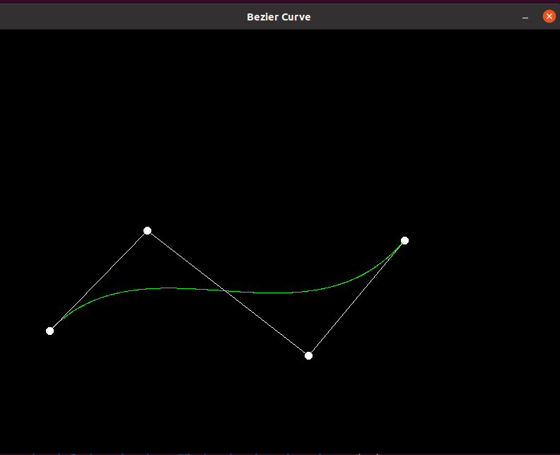
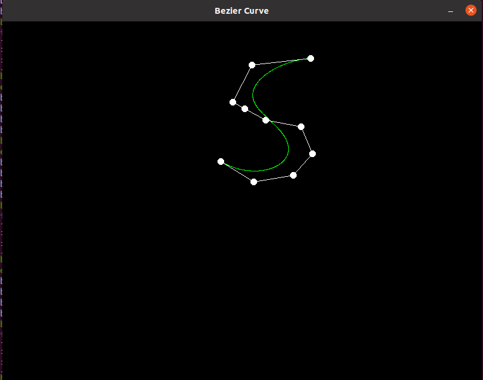

# 计算机图形学实验6

杨伯宇		18340189


## Task 1、实现de_Casteljau算法，并用它来绘制Beizer曲线


对于 bezier函数，只需要对t在0~1之间进行迭代，在每次迭代中，调用de_Casteljau函数，计算出在当前t值下的Beizer曲线中点的坐标。并且将该点绘制出来。在绘制的时候，参考naive_bezier函数中的

```c++
window.at<cv::Vec3b>(point.y, point.x)[2] = 255;
```

它绘制出来的是红色曲线，容易想到这是rgb颜色空间，将颜色的第二个分量改为255即可得到绿色的点。

对于de_Casteljau函数，需要递归的计算。但是考虑到递归对内存的消耗较大（写的时候是这样想的，但是实际上消耗的内存为$O(control\_points.size()^2)$），在点的数量很少的时候，消耗不了多少内存，所以这里使用迭代的意义不大），使用迭代来代替递归。定义新，旧两个控制点向量，每次迭代中用旧的控制点计算新的控制点，最后令旧的控制点等于新的控制点。如果旧的控制点的数量为1时，就将该值返回。

代码如下

```c++
cv::Point2f de_Casteljau(const std::vector<cv::Point2f> &control_points, float t)
{
    // TODO: Implement de Casteljau's algorithm
    auto point_list = control_points;
    std::vector<cv::Point2f> new_point_list;
    while (point_list.size() != 1)
    {
        for (int i = 0; i < point_list.size() - 1; ++i)
        {
            new_point_list.push_back(t * point_list[i] + (1 - t) * point_list[i + 1]);
        }
        point_list = new_point_list;
        new_point_list.clear();
    }
    return point_list[0];
}

void bezier(const std::vector<cv::Point2f> &control_points, cv::Mat &window)
{
    // TODO: Iterate through all t = 0 to t = 1 with small steps, and call de Casteljau's
    // recursive Bezier algorithm.
    for (float t = 0; t <= 1; t += 0.001)
    {
        auto point = de_Casteljau(control_points, t);
        window.at<cv::Vec3b>(point.y, point.x)[0] = 255;
    }
}
```

结果如下



## TASK2 、在Task 1的基础上，调整一下代码以支持更多的控制点

结果如下，



## Task 3、谈谈你对Beizer曲线的理解。

Beizer曲线是一种把折线段拟合成曲线的算法，而且可以做到在首尾两端点的切线和折线重合（方向和位置），它使用了排列组合的思想，即令
$$
\sum\limits_{i=0}^{n}a_i=1
$$
那么，对于点$p_0,p_1,\dots,p_n$形成的闭包中的人任意一点$p$，有
$$
p=\sum\limits_{i=0}^n(a_i\times p_i)
$$
如果令$a_i=a_i(t)$，且$a_i(t)$是连续函数的话，那么显然有
$$
p(t)=\sum\limits_{i=0}^n(a_i(t)\times p_i)
$$
也是连续函数，那么就可以在闭包内画出一条曲线。而对于$a_i(t)$的选取，令$t\in[0,1]$,有
$$
\begin{aligned}
1^n=(t+(1-t))^n&=\sum\limits_{i=0}^n\C_{n}^{i}t^i(1-t)^{n-i}\\
&=\sum_{i=0}^n\frac{n!}{i!(n-i)!}t^i(1-t)^{n-i}\\
&=\sum\limits_{i=0}^{n}a_i(t)
\end{aligned}
$$
所以令
$$
a_i(t)=a(i,t)=\frac{n!}{i!(n-i)!}t^i(1-t)^{n-i}
$$
即可得到一条连续的曲线，而且这条曲线有非常好的性质
$$
p(0)=p_0\\
p(1)=p_n\\
$$
等等。

而考虑到
$$
\begin{aligned}
p(t)&=\sum\limits_{i=0}^n(\frac{n!}{i!(n-i)!}t^i(1-t)^{n-i}\times p_i)\\
&=\sum\limits_{i=0}^{n-1}\frac{(n-1)!}{i!(n-1-i)!}t^{i}(1-t)^{n-i-1}  ((1-t)\times p_i+t\times p_{i+1})\\
&=\sum\limits_{i=0}^{n-1}\frac{(n-1)!}{i!(n-1-i)!}t^{i}(1-t)^{n-i-1}  (t\times p_i+(1-t)\times p_{i+1})\\
\end{aligned}
$$
即可从该公式得到de Casteljau算法