# 计算机图形学实验7

杨伯宇 		18340189

### Task1：完善rope.cpp 中的 Rope::rope(...)。

首先，通过线性分割，找到每个质点的位置，

```cpp
start + (end - start) * (double(i) / num_nodes)
```

对于质点，创建一个mass对象，要把pinned赋值为false，再加入到masses向量中。

加入由n个质点，就有n-1个弹簧，每个弹簧要加入其两端连接质点的指针，并设置弹性系数

最后把pinned_node里的质点的pinned设置为true

```cpp
for (int i = 0; i < num_nodes; ++i)
{
    Mass *new_mass = new Mass(start + (end - start) * (double(i) / num_nodes), node_mass, false);
    masses.push_back(new_mass);
    if (i != 0)
    {
        Spring *new_spring = new Spring(masses[i - 1], masses[i], 100);
        springs.push_back(new_spring);
    }
}
for (auto &i : pinned_nodes)
{
    masses[i]->pinned = true;
}
```

结果如下

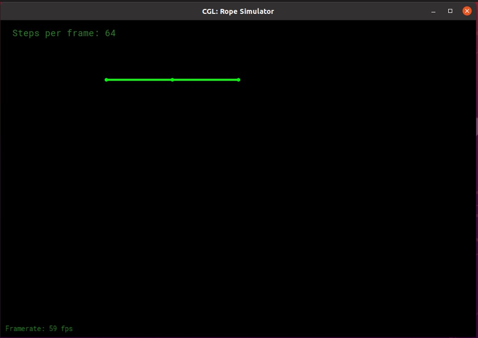

### Task2：完善rope.cpp 中的 Rope::simulateEuler(...)

首先可以知道，每个质点收到的力只与其相邻的弹簧有关，故遍历弹簧，使用胡可定律求出每个质点的受力情况

```cpp
for (auto &s : springs)
{
    // TODO (Part 2): Use Hooke's law to calculate the force on a node
    auto d = s->m2->position - s->m1->position;
    s->m1->forces += s->k * d / d.norm() * (d.norm() - s->rest_length);
    s->m2->forces -= s->k * d / d.norm() * (d.norm() - s->rest_length);
}
```

其次，对于每个点，首先计算其的阻力根据公式可知为

```cpp
f_damping=-k_d*velocity
```

再，计算其加速度。由$F=Ma$可知$a=F/M$。故

```cpp
double kd = 0.005;
Vector2D a = (gravity + m->forces - kd * m->velocity) / m->mass;
```

再带入公式求出新的位置

```cpp
m->velocity += a * delta_t;
m->position += m->velocity * delta_t;
```

半隐式欧拉方法

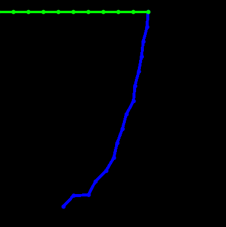

显示欧拉法绳子会被直接甩飞，很难截图

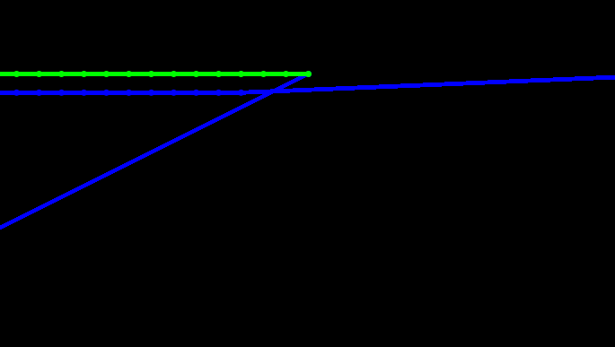

现在来比较不同步数

首先是显示欧拉法

step=16绳子直接甩飞，无法截图

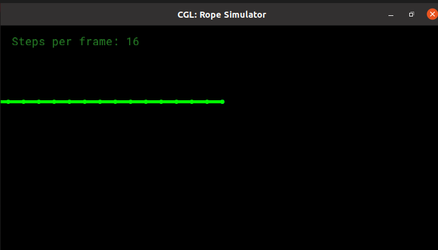

step=64 可以看到一点，但是难以截图

step=256,绳子再最初的一小段时间正常摆动，然后疯狂乱跑

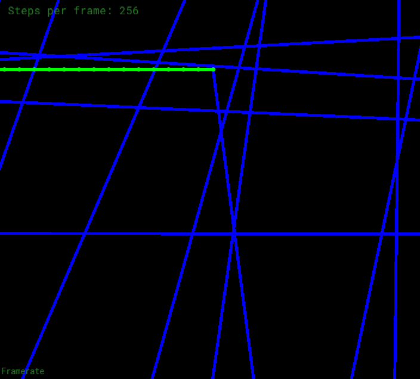

step=1024

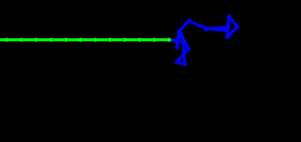

绳子再更长的一段时间里正常摆动，但是仍然会乱

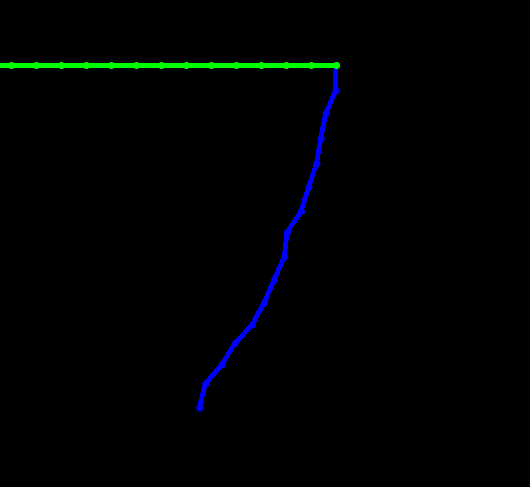

当把step设置为10000时，可以在更长的时间里正常摆动，但是仍然会乱晃，可见绳子乱换是次处显性欧拉法不收敛所致，我们只能通过增大step使其正常的时间变长，但仍然不收敛。

下面半隐式欧拉法

step=16:绳子刚开始有些许抖动，但是很快就停下来了

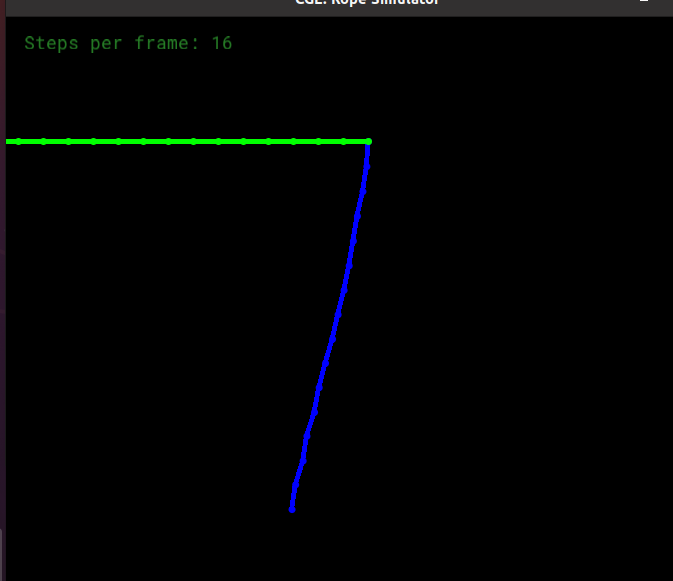

step=64：仍然会抖动，但是没有之前那么剧烈

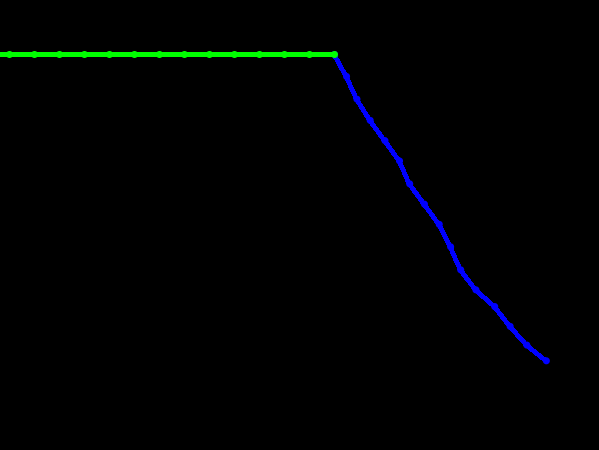

step=256:抖动程度更低

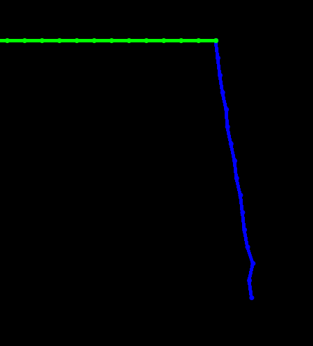

step=1024:

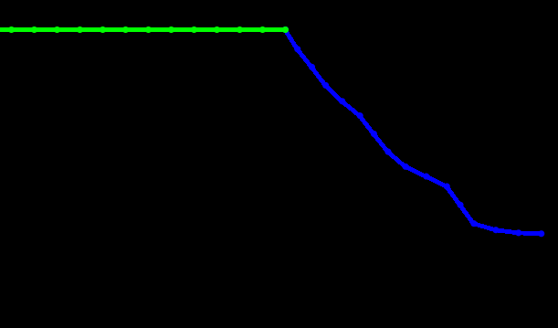

绳子仍然是会抖动，可见，单纯的增加step对防止抖动的效果并不好

下面看阻尼，这里只考虑半显示欧拉，step=1024

阻尼为0时

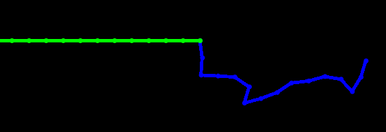

绳子会缩成一团，一直停不下来

阻尼为0.001时，抖动会好一点，很长一段时间后，最终会停下来

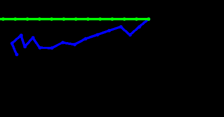

阻尼为0.01时，绳子的摆动变的更加自然，很快就会停下来

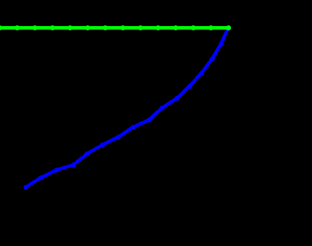

阻尼为0.1时，绳子几乎没有拍动，很快就停了下来，但同时也没有阻尼为0.01时自然

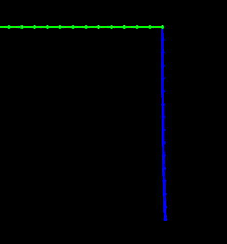

### Task3：完善rope.cpp 中的 Rope::simulateVerlet(...)

在第一步改变质点位置的时候要注意，因为有一个点时固定的，所以相邻弹簧对应的另一个点的长度变化应该是其他点的两倍

```cpp
auto d = s->m2->position - s->m1->position;
if (s->m1->pinned != 1)
{
    s->m1->position += (d.norm() - s->rest_length) / 2 * d / d.norm();
    s->m2->position += -(d.norm() - s->rest_length) / 2 * d / d.norm();
}
else
{
    s->m2->position += -(d.norm() - s->rest_length) * d / d.norm();
}
```

在使用Verlet法的时候,应该把mass的last_position 作为上一次的位置（刚开始就是初始位置），所以在每次计算完成后，都要修改last_position的值

```cpp
Vector2D temp_position = m->position;
m->position += (1 - damp_factor) * (m->position - m->last_position) + gravity * delta_t / 2 * delta_t / 2;
m->last_position = temp_position;
```

结果如下

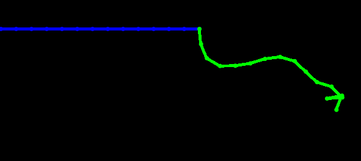

刚开始的摆动非常正常，但是紧接着会和之前一样缩成一团，开始抖动，最后有会摆的很慢，而且很自然。

下面看不同步数的情况

step=16:可以看到末尾的质点有旋转的现象

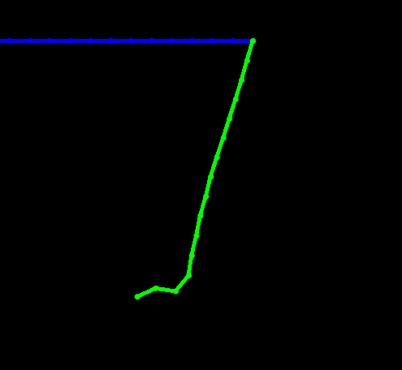

step=64:同样也有反转，抖动没有明显的消除

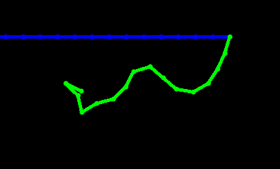

step=256:抖动现象明显比以前好了很多

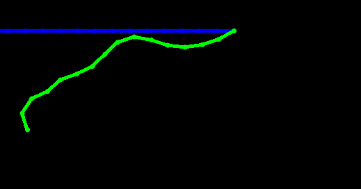

step=1024:此时摆动已经非常自然了，出来末尾有点突兀

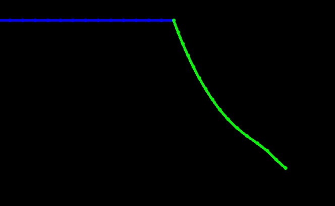

下面看不同的阻尼系数,step设为1024

阻尼系数为0时：会有反转的现象，后面还会缩成一团震荡

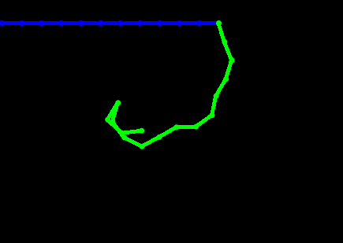

阻尼系数为0.00005时：绳子下落明显变慢，且没有怎么震荡

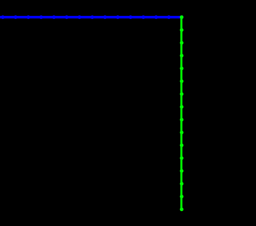

阻尼系数为0.0005时：绳子以很慢的速度下降，最后仍然垂直

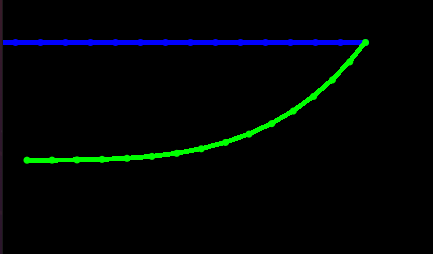

阻尼系数为0.005时：绳子以极慢的速度下降，非常不自然，但是最终仍然会垂直

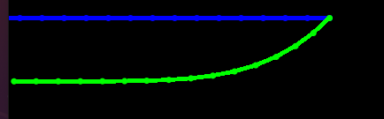

